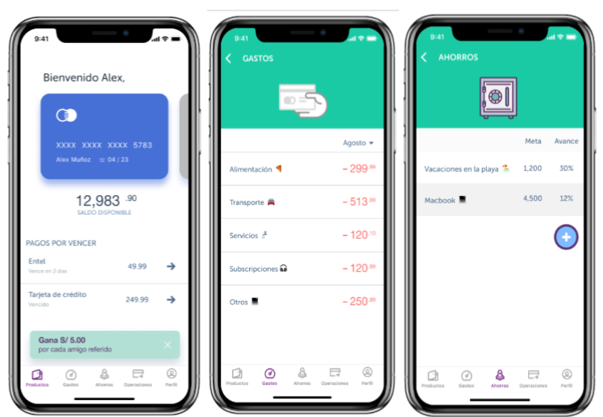
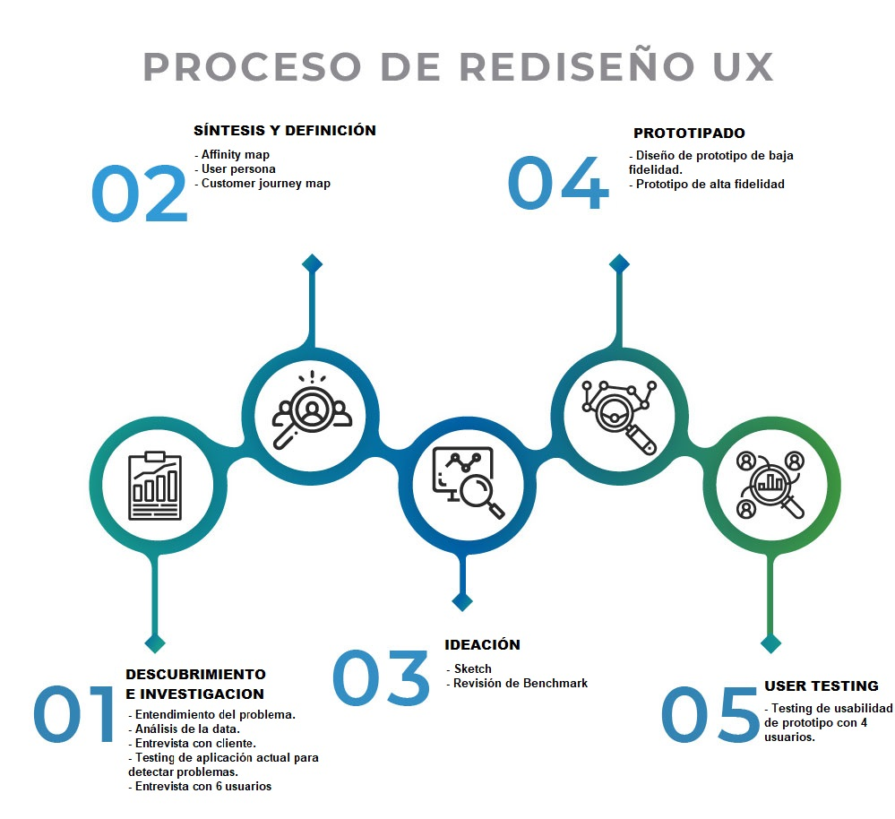
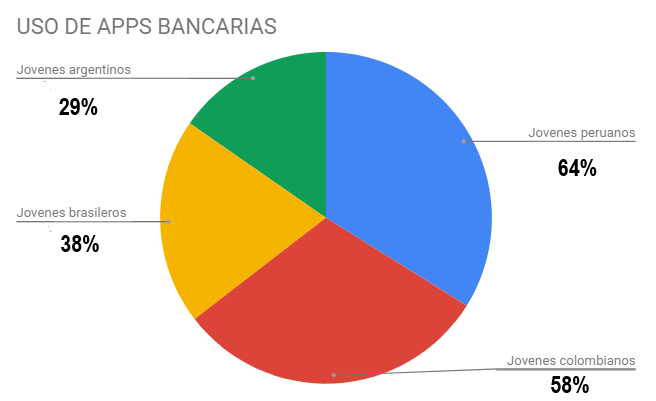
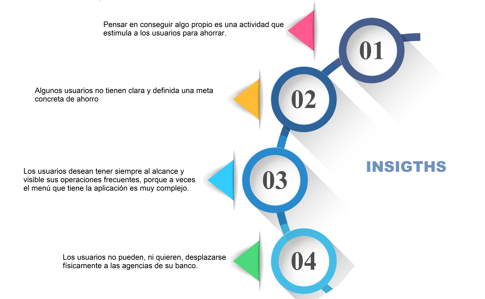
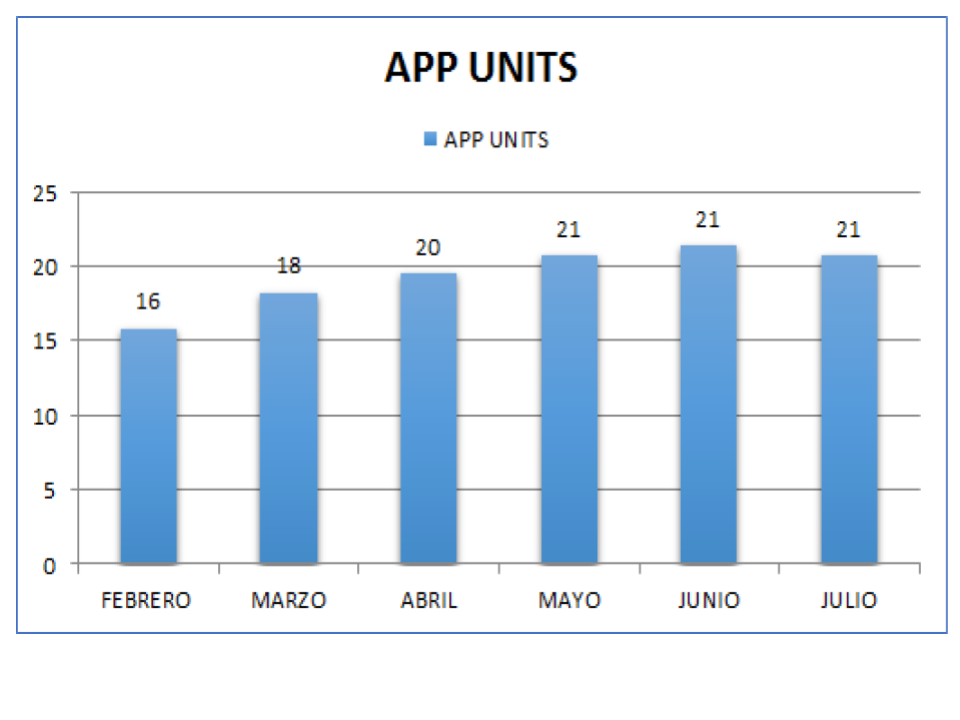
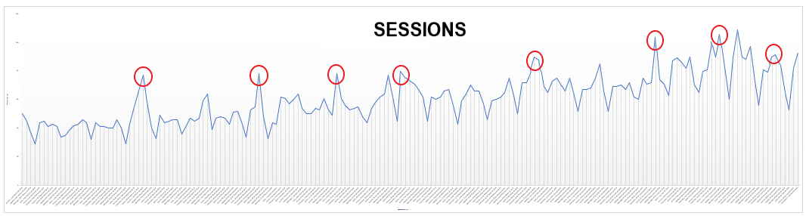
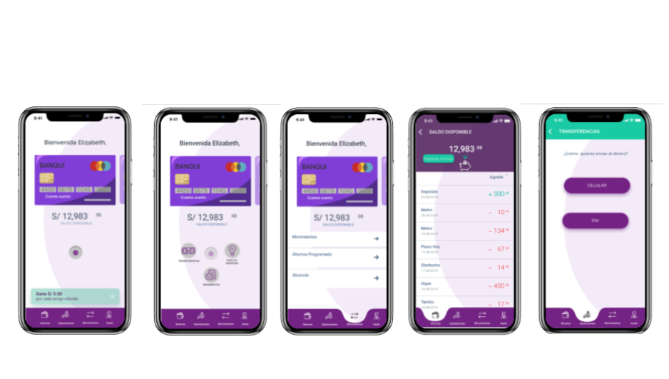
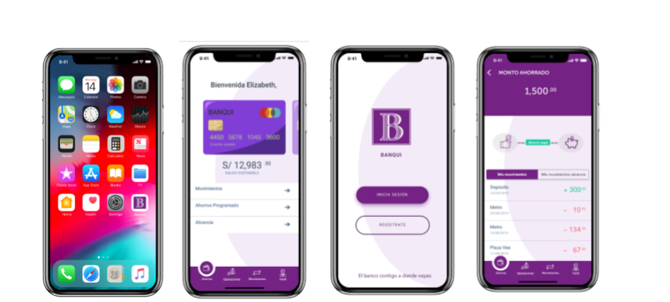

# __**REDISEÑO DE LA APLICACION FINANCIERA "BANQUI"**__

El banco más importante del país, siguiendo las tendencias de otros países, está planeando lanzar un banco 100% digital bajo otro nombe: "Banqui". Su principal objetivo es tener un banco que sea más cercano a las necesidades del público más joven del país. Para ello han venido piloteando un app con un número pequeño de usuarios. Los resultados de este piloto son mixtos, hay algunas cosas que han sido bien recibidas por los usuarios, y hay otras que se tienen que mejorar aún.
Para poder ayudarlos a entender mejor las necesidades de sus clientes y crear el mejor banco digital del país han decidido buscar el apoyo de una consultora de UX de Laboratoria, para lo que nos enviaron los siguientes recursos en [DRIVE](https://drive.google.com/drive/folders/1etdcDyoN7C038ti_i4RhavK2DWEAc1yH)
 

Este era el prototipo inicial:

 

## __OBJETIVOS DEL PROYECTO__

* Analizar la data de uso en general, para ver cuál es la respuesta de los usuarios hacia la aplicación.
* Testear e Identificar problemas que posee la aplicación actualmente.
* Rediseñar prototipo navegable actual.

 

## __ENTENDIMIENTO DEL PROBLEMA__

### __I. INVESTIGACION CONTEXTUAL__
Con el apuntado cambio de paradigma y ante unos usuarios cada vez más exigentes, el sector bancario tiene la necesidad de innovar y mejorar la experiencia de sus usuarios, así como de generar confianza y seguridad en los mismos.
Pero, ¿Cómo se comportan los jóvenes peruanos ante el uso de aplicaciones bancarias?
Los peruanos entre 18 y 35 años son los que más usan la tecnología, sobre todo al momento de realizar pagos por Internet. Las aplicaciones bancarias que más frecuentan, las medidas de seguridad y autenticación más confiables, las expectativas y métodos de pagos de acá a 10 años, entre otros, fueron analizadas en un reciente estudio. Con el fin de entender los comportamientos de los usuarios de cada país, Vocalink, una empresa de Mastercard vinculada al sistema de pagos, realizó el análisis sobre los jóvenes peruanos y su dinero. Este arrojó estadísticas sobre su postura ante diferentes enfoques de la economía.

__SOBRE EL USO DE APPS BANCARIAS__

En cuanto a la postura de los jóvenes frente a la tecnología, el 49% indica que le gustaría ser visto usando los últimos modelos de celulares, en donde, en este caso, los hombres (55%) evidencian más interés que las mujeres (46%).

__EN CUANTO A SOLUCIONES DE SEGURIDAD Y AUTENTICACIÓN__ .- Priorizan la seguridad (52%) por encima de la comodidad (28%), por lo que la mayoría de ellos opina que las aplicaciones bancarias y de servicios financieros son una solución que combina adecuadamente ambos puntos. Sin embargo, el 35% de los jóvenes peruanos expresó su preocupación de que los pagos móviles no funcionen porque su teléfono se quede sin batería.
Para los jóvenes peruanos, el escaneo de huella (65%) es considerado la forma de verificación de pagos más segura. En segundo lugar, está el PIN (15%), seguido de escaneos de retina (9%), autorización por voz (4%), reconocimiento facial (4%) y microchip bajo la piel (3%).

__PANORAMA DEL FUTURO DE LOS PAGOS__.- Finalmente, el estudio revela las proyecciones de los jóvenes peruanos y cómo esperan que la industria evolucione de acá al 2028. Por ejemplo, el 67% espera hacer pagos inmediatos, independientemente del proveedor de servicios financieros del destinatario, y el 30% espera tener una sola tarjeta y poder escoger si la usa como débito o crédito.
Más de la mitad (52%) de la muestra espera pagar usando solo la huella del pulgar; es decir, sin tarjetas ni teléfonos, y más de una quinta parte (21%) de los jóvenes peruanos espera tener toda su información financiera almacenada en un chip bajo la piel.
Según la Superintendencia de Banca, Seguros y AFP (SBS) el ahorro es fundamental en el desarrollo de un país, teniendo como consecuencia un sistema financiero sólido y estable. Dentro de los principales motivos por los cuales las personas ahorran, se encuentran: el conseguir sus metas a corto y largo plazo, prevenir gastos repentinos y protegerse en la vejez.
En el Perú, el 70% de los adultos mayores de 25 años ahorra, pero solo el 49% de los jóvenes entre 18 a 24 años lo hace. ¿A qué se deben están diferencias entre adultos y jóvenes? Pues la falta de ingresos, la poca información sobre cuentas de ahorro, costos y rentabilidad; son algunas de las barreras que enfrentan los jóvenes para mantener una cuenta bancaria. En ese sentido, es importante fomentar una cultura de ahorro en la población, con la finalidad de prolongar y consolidar un hábito que empiece desde la niñez y se mantenga a lo largo de la vida. Podemos concluir entonces que la importancia de generar hábitos de ahorro en jóvenes tendrá como consecuencia el crecimiento del Sistema Financiero, el cual pasa por un proceso importante de transformación digital, con el objetivo principal de introducir nuevos productos digitales, los cuales fortalezcan la relación entre la banca y sus usuarios.

### __II. PROBLEMAS A NIVEL DE NEGOCIO Y USUARIO__

Para conocer el problema de la aplicación BANQUI, nos entregaron la data de uso de los últimos 6 meses junto con  los resultados que generaron el MVP de la aplicación. 
Se programó entrevistas con el cliente y usuarios, de donde se puede conocer un poco más el estado y las proyecciones que se tienen sobre la aplicación, tanto para el cliente como para el usuario:

__A)__ __Problemas a nivel cliente__
* La aplicación solo está segmentada para un público objetivo que tienen dispositivos iOS.
* No está claro que es una app de ahorro perteneciente al banco.
* Quieren ser como un asistente para aprender ahorrar.
* Quieren crear metas para ahorrar (ahorro con objetivos) dirigido principalmente a jóvenes usuarios pero no encuentran la forma de llegar a ellos.
 
__B)__ __Problemas a nivel usuario__
* La aplicación no presenta las funcionalidades que el usuario busca.
* Algunos usuarios no planifican sus ahorros, por eso, esperan ser incentivado o motivado mediante sugerencias o tips de ahorro.
* Algunos usuarios preferirian realizar todas sus operaciones por la aplicación.
* El flujo de la app es confuso para los usuarios, ya que se perdían al momento de elegir las opciones del menú.

__C)__ __Insights__

### __III. ANÁLISIS DE LA DATA__
Los datos recopilan información de los últimos 6 meses de actividad de la aplicación "BANQUI". Algunas conclusiones importantes:

* __App Units__: El número de descargas de aplicaciones por primera vez realizadas en la App Store

 Según la información revisada se puede calcular que el número de descargas promedio por día es de 16, siendo el mes de abril donde se inicia este  incremento durante los 6 meses de uso de la aplicación.

* __Sessions__: El número de veces que la aplicación se ha utilizado durante al menos dos segundos.

 Al analizar el número de veces de  uso de  la aplicación, se observó que el uso desde Febrero a Julio, tiene picos altos en los periodos de quincena y fin de mes, comprobandose que los usuarios usan la aplicación para interactuar con su cuenta(pagar montos, revisar movimientos, etc)

## __RECOMENDACIONES__

Como parte del proceso, se juntaron todos los hallazgos y a partir de eso se comenzó a pensar e idear las formas de dar solución a cada uno de ellos. 

A partir del análisis se recomienda los siguientes desarrollos:

* Incorporar un Onboarding al descargar la app que muestre información básica para guiar al usuario.
* Eliminar pantallas innecesarias para realizar el registro en la app.
* Diseñar un menú visible (gadgets) con opciones de "pago de servicio", "ahorros", "transferencias".
* Implementar la opción de transferir con número de celular.
* Implementar otra opción para enviar dinero con el número de DNI.
* Crear una opción que se considere como una alcancia virtual para que el usuario abone segun considere necesario.
* Motivar el cumplmiento de su meta de ahorro con anuncios de beneficios y premios por lograrlo.

## PROTOTIPO

A partir de la priorización se trabajó en el diseño de una propuesta en Figma que contemplará todas estas modificaciones, en un prototipo de alta fidelidad.

__PRIMER PROTOTIPO DE ALTA__

__Testing del primer prototipo de alta fidelidad__

Se realizó un testing online del primer Prototipo de Alta Fidelidad a posibles usuarios de BANQUI, dándoles las siguientes tareas:

+ Registro en la aplicacion
+ Visualiza tus movimientos
+ Programa un ahorro
+ Pago de servicio de telefonía
+ Transferencia a cuenta
+ Envia dinero
+ Abona a tu alcancia del ahorro.

De donde se tienen las siguientes conclusiones, las cuales se tendrán en cuenta para poder realizar las mejoras.

+ Se identifica un problema durante el registro al momento de insertar la clave, indican que sea más específica.
+ Arreglar los íconos del gadget.
+ Alinear los formularios.
+ Quitar botones que no contrastan con el diseño.

## Diseño Final

[Link a FIGMA](https://www.figma.com/file/HNa8EMC6mZ6NfRo47p4VTy/App-Financiera---Banqui)

[Link a PROTOTIPO MARVEL ](https://marvelapp.com/6811981 )

## VIDEO
El demo de la aplicación realizado en Loom.

[Link a VIDEO LOOM ](https://www.loom.com/share/89c86e3b77f24a448e89de2d6584bd7c)

## GOOGLE DRIVE 
Toda la documentación de este proyecto se encuentra en este link:

[Link a DRIVE](https://drive.google.com/drive/folders/1TuloHfONGVA0vBNgffkVh2-lh1RGBCc9)

